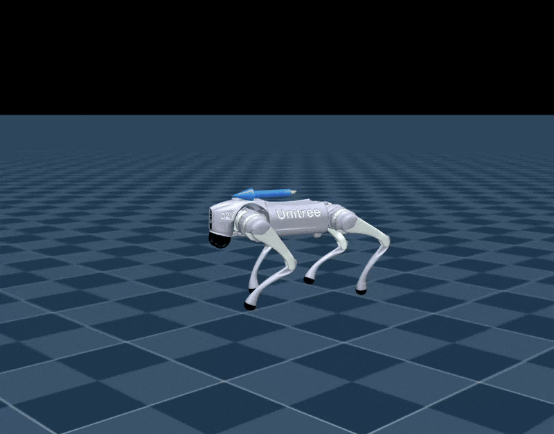
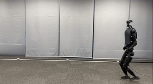

# Unitree RL Mjlab


## ✳️ 概述

Unitree RL Mjlab 是一个基于 [mjlab](https://github.com/mujocolab/mjlab.git) 构建的强化学习项目，
使用 MuJoCo 作为物理仿真后端，当前支持 Unitree Go2, A2, As2, G1, R1, H1_2 和 H2 机器人。

Mjlab 结合了 [Isaac Lab](https://github.com/isaac-sim/IsaacLab) 的成熟高层 API 与 
[MuJoCo](https://github.com/google-deepmind/mujoco_warp) 的高精度物理引擎，
为强化学习机器人研究与 Sim-to-Real（仿真到实机） 部署提供了一个轻量化、模块化的框架。

<div align="center">

| <div align="center">  MuJoCo </div>                                                                                                                                           | <div align="center"> Physical </div>                                                                                                                                               |
|-------------------------------------------------------------------------------------------------------------------------------------------------------------------------------|------------------------------------------------------------------------------------------------------------------------------------------------------------------------------------|
| <div style="width:250px; height:150px; overflow:hidden;"></div> | <div style="width:250px; height:150px; overflow:hidden;"></div> |

</div>


## 📦 安装配置

安装和配置步骤请参考 [setup.md](doc/setup_zh.md)


## 🔁 流程概览

使用强化学习实现机器人运动控制的基本流程如下：

`训练` → `仿真验证` → `仿真到实机`

- **训练**: 在 MuJoCo 模拟环境中让机器人与环境交互，并通过奖励函数最大化学习策略。
- **仿真验证**: 加载训练好的策略进行回放，验证策略行为是否符合预期。
- **仿真到实机**: 将策略部署到物理机器人上，实现真实环境中的运动控制。


## 🛠️ 使用指南

### 1. 速度跟踪训练

运行以下命令进行速度跟踪训练：

```bash
python scripts/train.py Unitree-G1-Flat --env.scene.num-envs=4096
```

多 GPU 训练：使用 --gpu-ids 扩展到多块 GPU：

```bash
python scripts/train.py Unitree-G1-Flat \
  --gpu-ids 0 1 \
  --env.scene.num-envs=4096
```

- 第一个参数(如 Mjlab-Velocity-Flat-Unitree-G1)为必选参数，确定要启用的训练环境。可选：
  - Unitree-Go2-Flat
  - Unitree-G1-Flat
  - Unitree-G1-23Dof-Flat
  - Unitree-H1_2-Flat
  - Unitree-A2-Flat
  - Unitree-R1-Flat

> [!NOTE]
> 更多有关详细说明，请参阅 mjlab 文档
> [mjlab documentation](https://mujocolab.github.io/mjlab/index.html).

### 2. 动作模仿训练

训练 Unitree G1 模仿参考动作序列。

<div style="margin-left: 20px;">

#### 2.1 准备动作文件

将准备好的 csv 格式的动作文件保存在 mjlab/motions/g1/ 目录下，执行下面的指令将其转为训练可用的 npz 文件：

```bash
python scripts/csv_to_npz.py \
--input-file src/assets/motions/g1/dance1_subject2.csv \
--output-name dance1_subject2.npz \
--input-fps 30 \
--output-fps 50
```

**npz文件默认保存路径为**：`src/motions/g1/...`

#### 2.2 训练

确保有可用的npz文件之后，执行以下指令进行训练：

```bash
python scripts/train.py Unitree-G1-Tracking-No-State-Estimation --motion_file=src/assets/motions/g1/dance1_subject2.npz --env.scene.num-envs=4096
```

</div>

> [!NOTE]
> 有关动作模仿训练的详细说明，请参阅BeyondMimic 文档
> [BeyondMimic documentation](https://github.com/HybridRobotics/whole_body_tracking/blob/main/README.md#motion-preprocessing--registry-setup).

#### ⚙️  参数说明
- `--env.scene`: 仿真场景配置，包括环境数量（num_envs）、物理仿真步长、地面类型、重力、随机扰动等参数。
- `--env.observations`: 观测空间配置，控制训练时输入到策略网络的状态信息，如关节位置、速度、IMU等内容。
- `--env.rewards`: 奖励函数配置，定义每步训练时的优化目标。
- `--env.commands`: 控制命令配置，用于生成训练时随机或指定的速度 / 姿态 / 动作指令。
- `--env.terminations`: 终止条件配置，定义训练 episode 的结束条件。
- `--agent.seed`: 训练随机种子，用于结果复现，不同 seed 会导致策略略有差异。
- `--agent.resume`: 是否从上次中断的 checkpoint 继续训练。 设置为 True 时，会自动加载最近一次保存的 .pt 模型文件。
- `--agent.policy`: 策略网络结构配置，例如 MLP 层数、隐藏维度、激活函数等。
- `--agent.algorithm`: 强化学习算法配置。可设置优化超参数，如学习率、批量大小、GAE λ 等。

**默认保存训练结果**：`logs/rsl_rl/<robot>_(velocity | tracking)/<date_time>/model_<iteration>.pt`

### 3. 仿真验证

如果想要在 MuJoCo 中查看训练效果，可以运行以下命令：

查看速度跟踪训练效果：
```bash
python scripts/play.py Unitree-G1-Flat --checkpoint_file=logs/rsl_rl/g1_velocity/2026-xx-xx_xx-xx-xx/model_xx.pt
```

查看动作模仿训练效果：
```bash
python scripts/play.py Unitree-G1-Tracking --motion_file=src/assets/motions/g1/dance1_subject2.npz --checkpoint_file=logs/rsl_rl/g1_tracking/2026-xx-xx_xx-xx-xx/model_xx.pt
```

**说明**：

- 训练时在每次保存模型时会同步导出 policy.onnx 文件在同层目录下，可用于实物部署。

**效果**：

| Go2                              | G1                             | H1_2                               | G1_mimic                          |
|----------------------------------|--------------------------------|------------------------------------|-----------------------------------|
|  |  |  |  |

### 4. 实物部署

实物部署前先确保主机安装了下列通信工具：
- [cyclonedds](https://github.com/eclipse-cyclonedds/cyclonedds.git)
- [unitree_sdk2](https://github.com/unitreerobotics/unitree_sdk2.git)

<div style="margin-left: 20px;">

#### 4.1 启动机器人
将机器人在吊装状态下启动，并等待机器人进入 `零力矩模式`

#### 4.2 进入调试模式
确保机器人处于 `零力矩模式` 的情况下，按下遥控器的 `L2+R2`组合键；此时机器人会进入`调试模式`, `调试模式`下机器人关节处于阻尼状态。

#### 4.3 连接机器人
使用网线连接电脑与机器人网口，并修改网络配置如下：
- 地址：`192.168.123.222`
- 子网掩码：`255.255.255.0`

然后使用 `ifconfig` 命令查看与机器人连接的网卡名称，记录后用于启动参数。

#### 4.4 编译
以 Unitree G1 速度控制为例（其他机器人同理）。
将策略文件（`policy.onnx`）放入`deploy/robots/g1/config/policy/velocity/vo/exported` 下，然后执行：

```bash
cd deploy/robots/g1
mkdir build && cd build
cmake .. && make
```

#### 4.5 部署

## 4.5.1 仿真部署

在实物部署前，建议使用[unitree_mujoco](https://github.com/unitreerobotics/unitree_mujoco)进行仿真部署，防止实物机器人出现异常动作。本框架已将其集成。

编译unitree_mujoco：

```bash
cd simulate
mkdir build && cd build
cmake .. && make -j8
```

启动仿真器(注意此处需连接上手柄才能启动)：

```bash
./simulate/build/unitree_mujoco
```

可在 `simulate/config` 中选择对应机器人

启动仿真控制程序：

```bash
cd deploy/robots/g1/build
./g1_ctrl --network=lo
```

## 4.5.2 实物部署

启动实物控制程序：

```bash
cd deploy/robots/g1/build
./g1_ctrl --network=enp5s0
```

**参数说明**：
- `network`: 连接机器人网卡名称，仿真部署使用 `lo`，实物机器人如 `enp5s0`(可使用 `ifconfig` 指令查看)

</div>

**实物效果**：

| Go2                                                    | G1                                                    | H1_2                                                    | G1_mimic                                           |
|--------------------------------------------------------|-------------------------------------------------------|---------------------------------------------------------|----------------------------------------------------|
|  |  |  |  |


## 🎉  致谢

本仓库开发离不开以下开源项目的支持与贡献，特此感谢：

- [mjlab](https://github.com/mujocolab/mjlab.git): 构建训练与运行代码的基础。
- [whole_body_tracking](https://github.com/HybridRobotics/whole_body_tracking.git): 用于动作跟踪的通用人形机器人控制框架。
- [rsl_rl](https://github.com/leggedrobotics/rsl_rl.git): 强化学习算法实现。
- [mujoco_warp](https://github.com/google-deepmind/mujoco_warp.git): 提供 GPU 加速渲染与仿真接口。
- [mujoco](https://github.com/google-deepmind/mujoco.git): 提供强大仿真功能。

